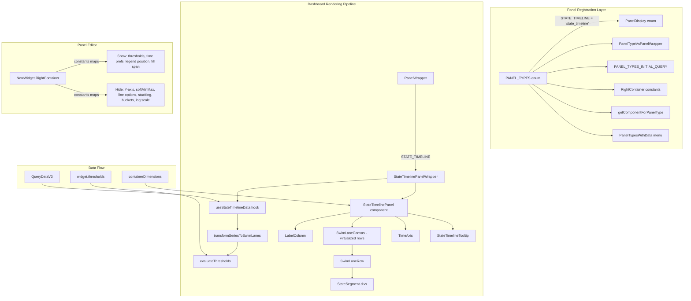
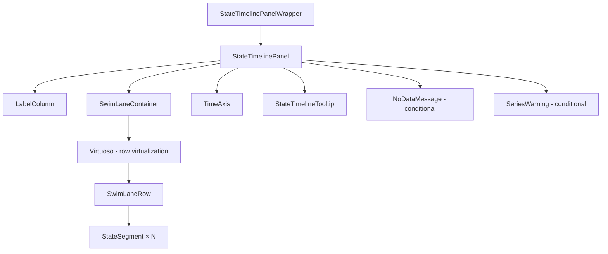
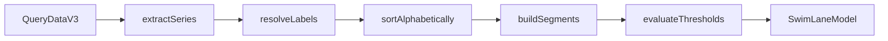

# Design Document: State Timeline Panel

## Overview

This design introduces a new `state_timeline` panel type to SigNoz dashboards that renders grouped time-series data as horizontal swim-lane rows with color-coded segments. Each row represents one grouped series (e.g., a service), and each segment within a row is colored based on threshold rules applied to the series value at that time interval.

The panel integrates into the existing panel infrastructure by extending the `PANEL_TYPES` enum, type maps, PanelWrapper constants, and component registries. It introduces a dedicated rendering pipeline that transforms `QueryDataV3` series data into a swim-lane segment model, evaluates threshold rules for coloring, and renders the result using DOM-based `<div>` elements with CSS for segments, combined with `react-virtuoso` for row virtualization.

**Key architectural decisions:**

1. **DOM-based rendering (divs + CSS)** over Canvas/SVG — segments are simple colored rectangles that benefit from React's declarative model, CSS transitions, native event handling for tooltips, and accessibility. At 50 rows × 500 segments, DOM node count (~25K) remains performant with virtualization limiting visible nodes to ~500-1500.

2. **react-virtuoso** for row virtualization — already used extensively in the codebase (logs, tables, legends). Handles dynamic row heights, scroll restoration, and overscan buffering.

3. **Pure data transformation layer** — a set of pure functions that convert `QueryDataV3` → swim-lane model, enabling straightforward property-based testing of correctness.

4. **Existing threshold system** — reuses the existing `ThresholdProps` type and threshold configuration UI, adding only the evaluation logic specific to segment coloring.

## Architecture



### Component Hierarchy



## Components and Interfaces

### New Components

| Component | Location | Purpose |
|-----------|----------|---------|
| `StateTimelinePanelWrapper` | `container/PanelWrapper/StateTimelinePanelWrapper.tsx` | PanelWrapper entry point, extracts data from queryResponse |
| `StateTimelinePanel` | `container/DashboardContainer/visualization/panels/StateTimelinePanel/StateTimelinePanel.tsx` | Main panel orchestrator |
| `LabelColumn` | `container/DashboardContainer/visualization/panels/StateTimelinePanel/LabelColumn.tsx` | Left label sidebar |
| `SwimLaneRow` | `container/DashboardContainer/visualization/panels/StateTimelinePanel/SwimLaneRow.tsx` | Single horizontal row of segments |
| `StateSegment` | `container/DashboardContainer/visualization/panels/StateTimelinePanel/StateSegment.tsx` | Individual colored rectangle |
| `TimeAxis` | `container/DashboardContainer/visualization/panels/StateTimelinePanel/TimeAxis.tsx` | Bottom time axis with ticks |
| `StateTimelineTooltip` | `container/DashboardContainer/visualization/panels/StateTimelinePanel/StateTimelineTooltip.tsx` | Hover tooltip |

### New Utility Modules

| Module | Location | Purpose |
|--------|----------|---------|
| `transformData` | `container/DashboardContainer/visualization/panels/StateTimelinePanel/utils/transformData.ts` | QueryDataV3 → SwimLaneModel |
| `evaluateThreshold` | `container/DashboardContainer/visualization/panels/StateTimelinePanel/utils/evaluateThreshold.ts` | Threshold rule evaluation |
| `timeAxisUtils` | `container/DashboardContainer/visualization/panels/StateTimelinePanel/utils/timeAxisUtils.ts` | Tick interval computation |
| `legendResolver` | `container/DashboardContainer/visualization/panels/StateTimelinePanel/utils/legendResolver.ts` | Legend template interpolation |

### Key Interfaces

```typescript
// ===== Swim Lane Data Model =====

interface SwimLaneModel {
  rows: SwimLaneRowData[];
  timeRange: TimeRange;
}

interface TimeRange {
  start: number; // epoch seconds
  end: number;   // epoch seconds
}

interface SwimLaneRowData {
  label: string;
  segments: SegmentData[];
  seriesLabels: Record<string, string>; // original labels for context links
}

interface SegmentData {
  startTime: number;   // epoch seconds
  endTime: number;     // epoch seconds
  value: number | null;
  color: string;       // hex color from threshold evaluation
  thresholdLabel?: string; // optional label from matching threshold rule
}

// ===== Threshold Evaluation =====

interface ThresholdEvalResult {
  color: string;
  label?: string;
}

// ===== Time Axis =====

interface TickMark {
  position: number; // 0-1 fraction of total width
  label: string;    // formatted time string
  timestamp: number;
}

// ===== Tooltip =====

interface TooltipState {
  visible: boolean;
  x: number;
  y: number;
  segment: SegmentData | null;
  rowLabel: string;
}

// ===== Component Props =====

interface StateTimelinePanelProps {
  swimLaneModel: SwimLaneModel;
  width: number;
  height: number;
  isDarkMode: boolean;
  legendPosition: LegendPosition;
  onSegmentClick?: (segment: SegmentData, row: SwimLaneRowData) => void;
}

interface LabelColumnProps {
  labels: string[];
  rowHeight: number;
  scrollTop: number;
  maxWidth: number; // 200px cap
}

interface SwimLaneRowProps {
  row: SwimLaneRowData;
  timeRange: TimeRange;
  width: number;
  height: number;
  onSegmentHover: (segment: SegmentData, event: MouseEvent) => void;
  onSegmentLeave: () => void;
}

interface TimeAxisProps {
  timeRange: TimeRange;
  width: number;
  timezone: string;
}
```

## Data Models

### Data Transformation Pipeline



**Step 1: Extract Series** — Iterate `queryDataV3.series`, extract each `SeriesItem`.

**Step 2: Resolve Labels** — For each series:
- If a `legend` template exists on the QueryDataV3 response, interpolate `{{key}}` placeholders with label values.
- Otherwise, join all label `key=value` pairs with commas.

**Step 3: Sort Alphabetically** — Sort rows by resolved label (case-insensitive ascending).

**Step 4: Build Segments** — For each series:
- Parse the `values` array (`{ timestamp: number, value: string }[]`)
- Create segments: `segment[i] = { startTime: values[i].timestamp, endTime: values[i+1].timestamp, value: parseFloat(values[i].value) }`
- Last segment: `endTime = timeRange.end`
- Single data point: one segment spanning `[timeRange.start, timeRange.end]`
- Null/NaN values: `value = null`

**Step 5: Evaluate Thresholds** — For each segment, evaluate value against threshold rules in order. Assign color and optional label from first matching rule, or default gray (`#9CA3AF` light / `#6B7280` dark) if no match.

### Threshold Evaluation Algorithm

```typescript
function evaluateThreshold(
  value: number | null,
  thresholds: ThresholdProps[],
  defaultColor: string
): ThresholdEvalResult {
  if (value === null || isNaN(value)) {
    return { color: defaultColor };
  }

  for (const threshold of thresholds) {
    if (threshold.thresholdValue === undefined) continue;
    
    const matches = evaluateOperator(
      value,
      threshold.thresholdOperator ?? '>',
      threshold.thresholdValue
    );
    
    if (matches) {
      return {
        color: threshold.thresholdColor ?? defaultColor,
        label: threshold.thresholdLabel,
      };
    }
  }

  return { color: defaultColor };
}

function evaluateOperator(
  value: number,
  operator: ThresholdOperators,
  threshold: number
): boolean {
  switch (operator) {
    case '>':  return value > threshold;
    case '<':  return value < threshold;
    case '>=': return value >= threshold;
    case '<=': return value <= threshold;
    case '=':  return value === threshold;
    default:   return false;
  }
}
```

### Segment Width Calculation

Each segment's width is a proportion of the total available width:

```typescript
function getSegmentWidth(
  segment: SegmentData,
  timeRange: TimeRange,
  totalWidth: number
): number {
  const totalDuration = timeRange.end - timeRange.start;
  if (totalDuration <= 0) return 0;
  const segmentDuration = segment.endTime - segment.startTime;
  return (segmentDuration / totalDuration) * totalWidth;
}
```

Segments use `position: absolute` with `left` and `width` calculated from their time proportion, ensuring no gaps between adjacent segments.

### Time Axis Tick Computation

```typescript
function computeTickInterval(timeRangeSeconds: number): number {
  // Aim for 5-10 ticks
  const TARGET_TICKS = 7;
  const rawInterval = timeRangeSeconds / TARGET_TICKS;
  
  // Snap to human-friendly intervals
  const intervals = [
    60, 300, 600, 900, 1800, 3600, // minutes to 1h
    7200, 14400, 21600, 43200, 86400, // hours to 1d
    172800, 604800, 2592000, // 2d, 1w, 30d
  ];
  
  return intervals.find(i => i >= rawInterval) ?? intervals[intervals.length - 1];
}
```

The time axis reuses SigNoz's existing date/time formatting utilities (from `dayjs` with timezone support via the `useTimezone` provider).

## Correctness Properties

*A property is a characteristic or behavior that should hold true across all valid executions of a system — essentially, a formal statement about what the system should do. Properties serve as the bridge between human-readable specifications and machine-verifiable correctness guarantees.*

### Property 1: Data transformation preserves series count and labels

*For any* valid QueryDataV3 response with N non-null series entries, the `transformSeriesToSwimLanes` function SHALL produce a SwimLaneModel with exactly N rows, where each row's label corresponds to the resolved label of its source series.

**Validates: Requirements 3.1, 3.3, 7.2, 7.4**

### Property 2: Swim-lane rows are sorted alphabetically

*For any* SwimLaneModel produced by the transformation pipeline, the rows array SHALL be sorted such that for every adjacent pair `rows[i]` and `rows[i+1]`, `rows[i].label.toLowerCase() <= rows[i+1].label.toLowerCase()`.

**Validates: Requirements 3.2**

### Property 3: Segment boundaries are continuous and span the full time range

*For any* series with K data points within a time range [start, end], the transformation SHALL produce K segments where: (a) `segments[0].startTime === values[0].timestamp`, (b) `segments[K-1].endTime === end`, (c) for all adjacent segments, `segments[i].endTime === segments[i+1].startTime` (no gaps).

**Validates: Requirements 3.5, 3.6, 4.7**

### Property 4: Threshold evaluation applies first-match semantics with correct operator evaluation

*For any* numeric value and ordered list of threshold rules, `evaluateThreshold` SHALL return the color and label of the first rule whose operator/value condition is satisfied. If no rule matches, it SHALL return the default gray color with no label.

**Validates: Requirements 4.1, 4.2, 4.3, 4.4**

### Property 5: Time axis ticks are evenly spaced and aligned with segment boundaries

*For any* time range and panel width, the computed tick positions SHALL be evenly spaced with a human-friendly interval, and the axis left/right boundaries SHALL equal the time range start/end respectively.

**Validates: Requirements 5.2, 5.5**

### Property 6: Tooltip content includes all required fields with correct duration

*For any* segment in a swim-lane row, the tooltip content SHALL include: the segment's startTime formatted as a timestamp, the row's label, the segment's raw numeric value, the threshold label (if present), and the duration calculated as `segment.endTime - segment.startTime`.

**Validates: Requirements 6.2, 6.3**

### Property 7: Legend template resolution

*For any* legend template string containing `{{key}}` placeholders and a labels map, the resolved label SHALL replace each `{{key}}` with the corresponding value from the labels map, leaving unmatched placeholders as-is.

**Validates: Requirements 7.3**

### Property 8: Row height layout respects minimum and triggers overflow

*For any* panel height H and row count N, the computed row height SHALL be `max(floor(H / N), 20)`. When `N * 20 > H`, the component SHALL enable vertical scrolling.

**Validates: Requirements 9.3, 9.5**

### Property 9: Virtualization renders only visible rows plus buffer

*For any* scroll position within the swim-lane container, only the rows visible in the viewport plus a buffer of 5 rows above and below SHALL be rendered to the DOM.

**Validates: Requirements 11.4**

### Property 10: Tooltip positioning within panel bounds

*For any* mouse position (x, y) within the panel and tooltip dimensions (w, h), the tooltip SHALL be positioned such that `tooltipX + w <= panelWidth` and `tooltipY + h <= panelHeight`, adjusting placement direction as needed.

**Validates: Requirements 6.5**

### Property 11: Label column width clamping

*For any* set of series labels, the label column width SHALL be `min(maxLabelWidth + padding, 200)` pixels, where `maxLabelWidth` is the measured text width of the longest label. Labels exceeding the column width SHALL be truncated with ellipsis.

**Validates: Requirements 3.4**

## Error Handling

| Scenario | Handling |
|----------|----------|
| Empty series array (`series === null` or `series.length === 0`) | Display centered "No Data" message |
| Series with no values (`values.length === 0`) | Skip row (do not render empty row) |
| Non-numeric value in series (`parseFloat(value)` returns NaN) | Treat as null, apply gray color |
| More than 100 series | Render first 100 rows + display warning banner suggesting filters |
| Invalid threshold configuration (missing operator or value) | Skip that threshold rule during evaluation |
| Panel container has zero dimensions | Do not render chart content (guard via ResizeObserver check) |
| QueryResponse loading/error state | Show Spinner (loading) or error message (handled by PanelWrapper parent) |

## Testing Strategy

### Unit Tests (Example-Based)

- **Registration tests**: Verify `PANEL_TYPES.STATE_TIMELINE` exists in all required constants maps with correct values
- **Component rendering**: Render StateTimelinePanel with mock data, verify structure
- **Edge cases**: Zero series (No Data), single data point (full-width segment), 101+ series (warning)
- **Tooltip interaction**: Hover over segment, verify tooltip appears with correct content
- **Theme support**: Verify dark/light mode class application

### Property-Based Tests

The following property-based tests use `fast-check` (or the project's existing test infrastructure) with a minimum of **100 iterations** per property:

| Property | Test File | What's Generated |
|----------|-----------|-----------------|
| Property 1: Series count preservation | `transformData.property.test.ts` | Random QueryDataV3 with 0-50 series |
| Property 2: Alphabetical sort | `transformData.property.test.ts` | Random label strings |
| Property 3: Segment continuity | `transformData.property.test.ts` | Random sorted timestamp arrays |
| Property 4: Threshold evaluation | `evaluateThreshold.property.test.ts` | Random values × random threshold rule sets |
| Property 5: Time axis ticks | `timeAxisUtils.property.test.ts` | Random time ranges and widths |
| Property 6: Tooltip content | `tooltip.property.test.ts` | Random segments and row data |
| Property 7: Legend resolution | `legendResolver.property.test.ts` | Random templates and label maps |
| Property 8: Row height layout | `layout.property.test.ts` | Random heights and row counts |

Each property test is tagged with:
```
// Feature: state-timeline-panel, Property {N}: {property_text}
```

### Integration Tests

- Panel renders correctly within the dashboard grid
- Threshold configuration updates reflect in panel preview
- Time range changes trigger re-render without full remount
- Vertical scroll with virtualization shows correct rows

### Library Choice for Property Testing

The project uses **Jest** as its test runner. For property-based testing, we use **fast-check** (`fc`) which integrates seamlessly with Jest via `fc.assert(fc.property(...))`. This is a widely-used, well-maintained PBT library for TypeScript.

```bash
pnpm add -D fast-check
```

### Test Configuration

- Minimum 100 iterations per property (`numRuns: 100`)
- Seed-based reproducibility for CI stability
- Generators produce realistic data shapes (sorted timestamps, valid threshold operators, etc.)
