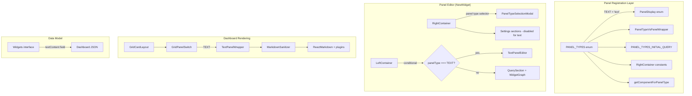
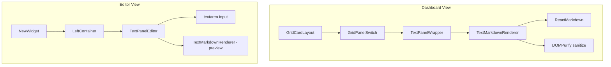

# Design Document: Text/Markdown Panel Type

## Overview

This design introduces a new `text` panel type to the SigNoz dashboard system. Unlike existing panel types that visualize query results, the text panel renders user-authored markdown or plain text content without executing any data queries. It integrates into the existing panel infrastructure by extending enums, type maps, and component registries while introducing a dedicated rendering path that bypasses the query execution pipeline.

The implementation leverages the existing `react-markdown` (v8), `rehype-raw`, `remark-gfm`, and `dompurify` libraries already present in the project, combined with a new `TextPanelWrapper` component that slots into the `PanelTypeVsPanelWrapper` mapping.

## Architecture



### Key Design Decisions

1. **Reuse existing markdown stack**: The project already has `react-markdown@8.0.7`, `rehype-raw@7.0.0`, `remark-gfm@3.0.1`, and `dompurify@3.4.0`. We reuse these rather than introducing new dependencies.

2. **Bypass query pipeline entirely**: The text panel short-circuits at the `LeftContainer` level — when `panelType === PANEL_TYPES.TEXT`, it renders the `TextPanelEditor` instead of `QuerySection` + `WidgetGraph`. On the dashboard, `TextPanelWrapper` renders directly without touching `useGetQueryRange`.

3. **Store content in widget data model**: The markdown content is stored as a `textContent` string field on the `Widgets` interface, persisted alongside the existing widget JSON. No new API endpoints are needed.

4. **Sanitization at render time**: Content is sanitized immediately before rendering using `dompurify` with a strict allowlist. This follows the existing pattern used in `LogDetailedView/utils.tsx`.

## Components and Interfaces

### New Components

| Component | Location | Purpose |
|-----------|----------|---------|
| `TextPanelWrapper` | `container/PanelWrapper/TextPanelWrapper.tsx` | Dashboard-mode renderer for text panels |
| `TextPanelEditor` | `container/NewWidget/LeftContainer/TextPanelEditor/TextPanelEditor.tsx` | Edit-mode textarea + live preview |
| `TextMarkdownRenderer` | `container/PanelWrapper/TextMarkdownRenderer.tsx` | Shared markdown rendering with sanitization |

### Component Hierarchy



### TextPanelWrapper

```typescript
// container/PanelWrapper/TextPanelWrapper.tsx
interface TextPanelWrapperProps {
  widget: Widgets;
}

function TextPanelWrapper({ widget }: TextPanelWrapperProps): JSX.Element {
  const content = widget.textContent || '';
  return (
    <div className="text-panel-wrapper">
      <TextMarkdownRenderer content={content} />
    </div>
  );
}
```

This component:
- Receives the full `Widgets` object from the panel rendering pipeline
- Extracts `textContent` from the widget data
- Delegates rendering to `TextMarkdownRenderer`
- Applies overflow scrolling via CSS (`overflow-y: auto`)

### TextPanelEditor

```typescript
// container/NewWidget/LeftContainer/TextPanelEditor/TextPanelEditor.tsx
interface TextPanelEditorProps {
  textContent: string;
  setTextContent: (content: string) => void;
}

function TextPanelEditor({ textContent, setTextContent }: TextPanelEditorProps): JSX.Element {
  // Debounced preview (300ms) + character counter
  // Split pane: left = textarea, right = live preview
}
```

This component:
- Provides a `<textarea>` (or Ant Design `Input.TextArea`) for content authoring
- Enforces the 10,000 character limit via `maxLength` attribute and visual counter
- Shows a live preview using `TextMarkdownRenderer` with 300ms debounce
- Does NOT render any query-related UI

### TextMarkdownRenderer

```typescript
// container/PanelWrapper/TextMarkdownRenderer.tsx
import ReactMarkdown from 'react-markdown';
import remarkGfm from 'remark-gfm';
import rehypeRaw from 'rehype-raw';
import DOMPurify from 'dompurify';

interface TextMarkdownRendererProps {
  content: string;
}

const ALLOWED_TAGS = [
  'h1', 'h2', 'h3', 'h4', 'h5', 'h6',
  'p', 'br', 'hr',
  'strong', 'b', 'em', 'i', 'del', 's',
  'ul', 'ol', 'li',
  'code', 'pre',
  'a',
  'blockquote',
  'table', 'thead', 'tbody', 'tr', 'th', 'td',
  'span', 'div',
];

const ALLOWED_ATTR = ['href', 'target', 'rel', 'class', 'className'];

function TextMarkdownRenderer({ content }: TextMarkdownRendererProps): JSX.Element {
  const sanitizedContent = DOMPurify.sanitize(content, {
    ALLOWED_TAGS,
    ALLOWED_ATTR,
    FORBID_TAGS: ['script', 'iframe', 'object', 'embed', 'form', 'style'],
    FORBID_ATTR: ['onerror', 'onclick', 'onload', 'onmouseover', 'onfocus'],
    ALLOW_DATA_ATTR: false,
  });

  return (
    <ReactMarkdown
      remarkPlugins={[remarkGfm]}
      rehypePlugins={[rehypeRaw]}
      components={{
        a: ({ href, children }) => (
          <a
            href={href}
            target="_blank"
            rel="noopener noreferrer"
          >
            {children}
          </a>
        ),
        code: CodeComponent, // reuse syntax highlighting pattern
      }}
    >
      {sanitizedContent}
    </ReactMarkdown>
  );
}
```

### Integration Points

#### 1. Panel Type Registration (`constants/queryBuilder.ts`)

```typescript
export enum PANEL_TYPES {
  // ... existing members
  TEXT = 'text',
}

export enum PanelDisplay {
  // ... existing members
  TEXT = 'Text/Markdown',
}
```

#### 2. Panel Wrapper Mapping (`container/PanelWrapper/constants.ts`)

```typescript
export const PanelTypeVsPanelWrapper = {
  // ... existing entries
  [PANEL_TYPES.TEXT]: TextPanelWrapper,
};
```

#### 3. Component Resolution (`constants/panelTypes.ts`)

```typescript
export const getComponentForPanelType = (panelType, dataSource) => {
  const componentsMap = {
    // ... existing entries
    [PANEL_TYPES.TEXT]: TextPanelWrapper,
  };
  return componentsMap[panelType];
};

// Text panel NOT included in export types
export const AVAILABLE_EXPORT_PANEL_TYPES = [
  PANEL_TYPES.TIME_SERIES,
  PANEL_TYPES.TABLE,
  PANEL_TYPES.LIST,
  // PANEL_TYPES.TEXT intentionally excluded
];
```

#### 4. Panel Type Selection (`DashboardContainer/PanelTypeSelectionModal/menuItems.tsx`)

```typescript
export const PanelTypesWithData: ItemsProps[] = [
  // ... existing entries (Time Series, Number, Table, List, Bar, Pie, Histogram)
  {
    name: PANEL_TYPES.TEXT,
    icon: <ScrollText size={16} color={Color.BG_ROBIN_400} />,
    display: PanelDisplay.TEXT,
  },
];
```

#### 5. RightContainer Constants (`NewWidget/RightContainer/constants.ts`)

All `panelTypeVs*` records get `[PANEL_TYPES.TEXT]: false` entries:
- `panelTypeVsThreshold`
- `panelTypeVsSoftMinMax`
- `panelTypeVsDragAndDrop`
- `panelTypeVsFillSpan`
- `panelTypeVsLogScale`
- `panelTypeVsYAxisUnit`
- `panelTypeVsCreateAlert`
- `panelTypeVsBucketConfig`
- `panelTypeVsPanelTimePreferences`
- `panelTypeVsColumnUnitPreferences`
- `panelTypeVsStackingChartPreferences`
- `panelTypeVsLegendPosition`
- `panelTypeVsLegendColors`
- `panelTypeVsContextLinks`
- `panelTypeVsDecimalPrecision`
- `panelTypeVsLineInterpolation`
- `panelTypeVsLineStyle`
- `panelTypeVsFillMode`
- `panelTypeVsShowPoints`
- `panelTypeVsSpanGaps`

#### 6. GridPanelSwitch (`container/GridPanelSwitch/types.ts`)

```typescript
export type PropsTypePropsMap = {
  // ... existing entries
  [PANEL_TYPES.TEXT]: null;
};
```

#### 7. LeftContainer Conditional (`NewWidget/LeftContainer/index.tsx`)

```typescript
function LeftContainer({ selectedGraph, ... }) {
  if (selectedGraph === PANEL_TYPES.TEXT) {
    return <TextPanelEditor textContent={...} setTextContent={...} />;
  }
  // ... existing query-based rendering
}
```

## Data Models

### Widget JSON Schema Extension

The `IBaseWidget` interface in `types/api/dashboard/getAll.ts` is extended with an optional `textContent` field:

```typescript
export interface IBaseWidget {
  // ... existing fields
  textContent?: string;  // Markdown content for text panels (max 10000 chars)
}
```

### Persisted Widget JSON Example

```json
{
  "id": "abc-123",
  "panelTypes": "text",
  "title": "Service Documentation",
  "description": "",
  "textContent": "## Overview\n\nThis dashboard monitors the **payment service**.\n\n### Key Metrics\n- Response time p99\n- Error rate\n- Throughput",
  "opacity": "1",
  "nullZeroValues": "zero",
  "query": {
    "queryType": "builder",
    "promql": [],
    "builder": { "queryData": [], "queryFormulas": [] },
    "clickhouse_sql": [],
    "id": "generated-id"
  }
}
```

Key points:
- `panelTypes` is set to `"text"` (the string value of `PANEL_TYPES.TEXT`)
- `textContent` holds the raw markdown string
- `query` is present but unused (required by `Widgets` interface); set to initial empty metrics query
- All visualization-specific fields (`thresholds`, `yAxisUnit`, etc.) remain at defaults

### Character Limit Enforcement

The 10,000 character limit is enforced at two levels:
1. **UI level**: `maxLength={10000}` on the textarea + visible character counter
2. **Model level**: The `setTextContent` setter truncates input exceeding 10,000 characters

## Correctness Properties

*A property is a characteristic or behavior that should hold true across all valid executions of a system — essentially, a formal statement about what the system should do. Properties serve as the bridge between human-readable specifications and machine-verifiable correctness guarantees.*

### Property 1: Text content persistence round-trip

*For any* valid UTF-8 string of length ≤ 10,000 characters stored as `textContent` in a widget, saving the dashboard and reloading it SHALL produce identical `textContent` in the widget data.

**Validates: Requirements 3.5**

### Property 2: Character limit enforcement

*For any* UTF-8 string, the text input component SHALL accept strings with length ≤ 10,000 and reject or truncate strings with length > 10,000, such that the stored `textContent` never exceeds 10,000 characters.

**Validates: Requirements 3.3**

### Property 3: Heading rendering correctness

*For any* heading level n (1–6) and any non-empty text string t, the markdown input `"#".repeat(n) + " " + t` SHALL produce an HTML element `<h{n}>` containing t in the rendered output.

**Validates: Requirements 4.1**

### Property 4: Inline formatting rendering

*For any* non-empty text string t, wrapping t in `**` (or `__`) SHALL produce a `<strong>` element, and wrapping t in `*` (or `_`) SHALL produce an `<em>` element in the rendered output.

**Validates: Requirements 4.2, 4.3**

### Property 5: List structure preservation

*For any* list structure with items at nesting depths 1–4, the markdown renderer SHALL produce correctly nested `<ul>/<ol>` and `<li>` elements matching the input structure's depth and ordering.

**Validates: Requirements 4.4, 4.5**

### Property 6: Inline code content preservation

*For any* string s (including strings with whitespace and special characters), wrapping s in backticks SHALL produce a `<code>` element whose text content is identical to s.

**Validates: Requirements 4.6**

### Property 7: Fenced code block rendering

*For any* multi-line string s and any language identifier lang, a fenced code block (triple backtick + lang) SHALL render a code block element with a class or attribute indicating the language identifier.

**Validates: Requirements 4.7**

### Property 8: Link rendering with security attributes

*For any* text t and valid URL u, the markdown `[t](u)` SHALL produce an `<a>` element with `href=u`, `target="_blank"`, and `rel="noopener noreferrer"`.

**Validates: Requirements 4.8, 7.4**

### Property 9: Table structure rendering

*For any* table with h header columns and r data rows (h ≥ 1, r ≥ 1), pipe-delimited markdown table syntax SHALL produce an HTML `<table>` with a `<thead>` containing h `<th>` cells and a `<tbody>` containing r `<tr>` rows each with h `<td>` cells.

**Validates: Requirements 4.12**

### Property 10: Comprehensive sanitization

*For any* input string containing `<script>`, `<iframe>`, `<object>`, `<embed>`, or `<form>` tags, event handler attributes (any attribute matching `/^on/i`), or `javascript:`, `vbscript:`, or `data:` URI schemes, the rendered HTML output SHALL contain none of these dangerous elements, attributes, or URI schemes.

**Validates: Requirements 4.13, 7.1, 7.2, 7.3, 7.5**

### Property 11: Malformed markdown resilience

*For any* string containing unclosed or malformed markdown syntax (unclosed `**`, unterminated `[`, mismatched backticks), the markdown renderer SHALL produce output without throwing an exception, rendering the malformed portions as plain text.

**Validates: Requirements 4.14**

### Property 12: Plain text paragraph wrapping

*For any* plain text string (containing no markdown-special characters), the renderer SHALL wrap the content in `<p>` paragraph elements.

**Validates: Requirements 4.11**

### Property 13: Nested inline formatting in block elements

*For any* block element (list item, blockquote, table cell) containing nested inline formatting (bold, italic, code, links), the renderer SHALL correctly produce both the block structure and the inline elements within it.

**Validates: Requirements 4.15**

## Error Handling

| Scenario | Handling |
|----------|----------|
| `textContent` is `undefined` or `null` | Render empty panel body — no error, no placeholder text |
| `textContent` contains only whitespace | Render empty — whitespace-only content produces empty paragraphs |
| Malformed markdown (unclosed bold, broken links) | `react-markdown` gracefully renders malformed tokens as plain text |
| DOMPurify strips all content (fully malicious input) | Render empty output — no error thrown |
| `TextPanelWrapper` throws during render | React error boundary at `GridCardLayout` level catches it; panel shows error state consistent with other panel failures |
| Widget JSON missing `textContent` field (legacy dashboards) | Default to empty string; panel renders blank |
| Extremely long content (at character limit) | Performance handled by `react-markdown`'s streaming parser; scrollbar accommodates overflow |

## Testing Strategy

### Unit Tests (Example-Based)

- Panel type registration: verify all enum entries, constant map entries, and TypeScript compilation
- Panel type selector: verify `Text/Markdown` appears as last item with correct icon
- Editor rendering: verify textarea appears, query section is hidden for text panel type
- No query execution: mock API layer, render text panel, assert zero API calls
- Dashboard display: verify scroll behavior, theme application, title/no-title states
- Feature exclusion: verify all `panelTypeVs*` constants return `false` for TEXT

### Property-Based Tests

**Library**: `fast-check` (already compatible with the project's Jest + React Testing Library setup)

**Configuration**: Minimum 100 iterations per property test.

Each property test SHALL be tagged with:
```
Feature: text-markdown-panel, Property {N}: {property text}
```

**Properties to implement:**
1. Text content persistence round-trip (Property 1)
2. Character limit enforcement (Property 2)
3. Heading rendering correctness (Property 3)
4. Inline formatting rendering (Property 4)
5. List structure preservation (Property 5)
6. Inline code content preservation (Property 6)
7. Fenced code block rendering (Property 7)
8. Link rendering with security attributes (Property 8)
9. Table structure rendering (Property 9)
10. Comprehensive sanitization (Property 10)
11. Malformed markdown resilience (Property 11)
12. Plain text paragraph wrapping (Property 12)
13. Nested inline formatting in block elements (Property 13)

### Integration Tests

- End-to-end: create text panel → edit content → save → reload dashboard → verify content displayed
- Panel type switching: switch from Time Series to Text and back, verify state management
- Dashboard export/import: verify text panels survive JSON export and re-import

### What is NOT Property-Tested

- Grid resize/drag behavior (UI interaction, better suited for Playwright e2e)
- Theme application (CSS-level, visual regression)
- Performance timing (500ms render target — measured in dedicated perf tests)
- Navigation flow (route-level integration test)
